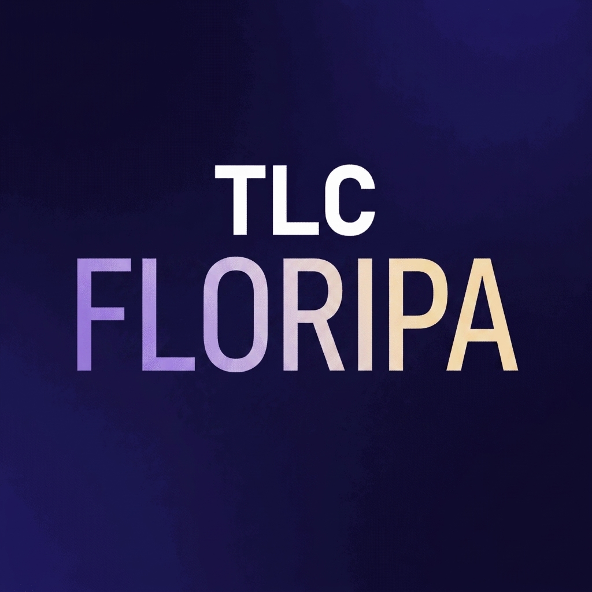

<p align="center">
  
</p>

<h1 align="center">Harness Engineering — Exercícios Práticos</h1>

<p align="center">
  Material de apoio do workshop <strong>"Harness Engineering: a arquitetura
  estrita para sistemas de agentes inteligentes"</strong><br/>
  apresentado no <strong>TLC Core Floripa</strong>.
</p>

---

## A ideia

> **O harness é a estrutura externa ao modelo que converte capacidade bruta em
> execução confiável.**

O erro arquitetural mais comum (e mais caro) é tratar o sistema como um wrapper
fino em volta do LLM. É o contrário: **o modelo é apenas uma peça; o sistema é o
harness.** Estes seis exercícios fazem você *sentir* isso no terminal — cada um
expõe um conceito que no slide parece óbvio mas na prática surpreende.

Os exercícios que mostram o **comportamento cru** do modelo chamam a Anthropic
API diretamente (sem Claude Code, sem framework de agente). Tudo é feito na mão,
para que a estrutura do harness fique visível no código.

## Os exercícios

| # | Pasta | O que você vai ver |
|---|-------|--------------------|
| 01 | [`ex01-diverging-responses`](ex01-diverging-responses) | O mesmo prompt, rodado 5× contra a API crua, produz respostas estruturalmente diferentes. |
| 02 | [`ex02-variance-cascade`](ex02-variance-cascade) | A variância se multiplica em cascata: uma cadeia de 3 passos diverge em árvore, sem nenhum passo parecer errado. |
| 03 | [`ex03-with-and-without-harness`](ex03-with-and-without-harness) | O mesmo problema com e sem harness: a taxa de sucesso muda de forma gritante. |
| 04 | [`ex04-runtime-loop`](ex04-runtime-loop) | O loop do agente construído na mão — o harness não pensa, ele roteia. |
| 05 | [`ex05-feedforward-feedback`](ex05-feedforward-feedback) | Guides (feedforward) e Sensors (feedback) fisicamente separados: previnem antes, detectam depois. |
| 06 | [`ex06-aggressive-harness`](ex06-aggressive-harness) | Harness agressivo demais destrói a capacidade do modelo — restrição em excesso também é falha arquitetural. |

## Setup (uma vez)

Pré-requisitos: **Node.js 18+** e uma **chave da Anthropic API**.

```bash
# 1. Instale as dependências de todos os exercícios (npm workspaces)
npm install

# 2. Configure sua chave
cp .env.example .env
#   edite .env e preencha ANTHROPIC_API_KEY=...
```

> **Sobre o modelo:** o default é `claude-sonnet-4-6` (configurável em `.env` via
> `ANTHROPIC_MODEL`). O `ex02` — e o uso de `temperature` em geral — exige um
> modelo da família 4.x que aceite sampling. Os modelos Opus 4.7/4.8 e Fable 5
> **rejeitam `temperature`** (HTTP 400); não os use como default aqui.
> `claude-haiku-4-5` também funciona e deixa a variância ainda mais visível.

## Como rodar

Depois do `npm install` na raiz (que linka o workspace `@harness/client`), cada
exercício roda de dentro da sua própria pasta:

```bash
cd ex01-diverging-responses
npm start
```

Ou, a partir da raiz, pelos atalhos de workspace:

```bash
npm run ex01    # ... até ex06
```

## Estrutura

```
harness-exercises/
├── README.md
├── CLAUDE.md            # contexto completo do workshop (13 conceitos)
├── .env.example
├── package.json         # npm workspaces
├── tsconfig.base.json
├── resources/
│   └── TLC_Floripa_Logo.jpg
├── packages/
│   └── client/          # @harness/client — cliente Anthropic + .env (compartilhado)
└── exNN-.../
    ├── CLAUDE.md         # contexto do exercício
    ├── README.md         # o que demonstra, como rodar, o que observar
    ├── package.json
    ├── tsconfig.json
    └── src/
```

## Aviso pedagógico

Este código é **didático, não production-ready**. Os exercícios que expõem o
comportamento cru do modelo (ex01, ex02, o modo sem harness do ex03) são
**intencionalmente sem validação** — esse é o ponto. Não os "corrija".

---

<p align="center"><sub>Feito para o TLC Core Floripa 💛</sub></p>
